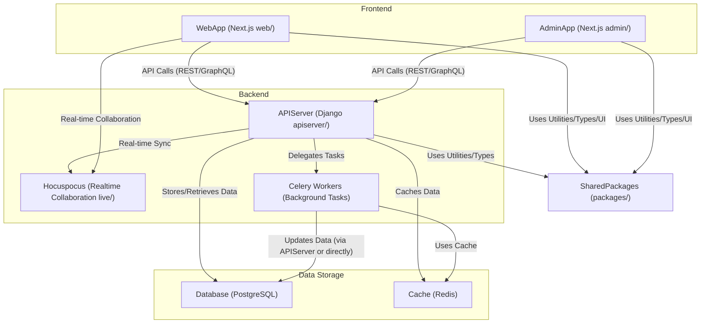

```mermaid
graph TD
    subgraph Frontend
        WebApp["WebApp (Next.js web/)"]
        AdminApp["AdminApp (Next.js admin/)"]
    end

    subgraph Backend
        APIServer["APIServer (Django apiserver/)"]
        Hocuspocus["Hocuspocus (Realtime Collaboration live/)"]
        CeleryWorkers["Celery Workers (Background Tasks)"]
    end

    subgraph "Data Storage"
        Database["Database (PostgreSQL)"]
        Cache["Cache (Redis)"]
    end

    SharedPackages["SharedPackages (packages/)"]

    WebApp -- "API Calls (REST/GraphQL)" --> APIServer
    AdminApp -- "API Calls (REST/GraphQL)" --> APIServer
    
    APIServer -- "Stores/Retrieves Data" --> Database
    APIServer -- "Caches Data" --> Cache
    APIServer -- "Delegates Tasks" --> CeleryWorkers
    CeleryWorkers -- "Updates Data (via APIServer or directly)" --> Database
    CeleryWorkers -- "Uses Cache" --> Cache
    
    APIServer -- "Real-time Sync" --> Hocuspocus
    WebApp -- "Real-time Collaboration" --> Hocuspocus
    
    WebApp -- "Uses Utilities/Types/UI" --> SharedPackages
    AdminApp -- "Uses Utilities/Types/UI" --> SharedPackages
    APIServer -- "Uses Utilities/Types" --> SharedPackages
```
